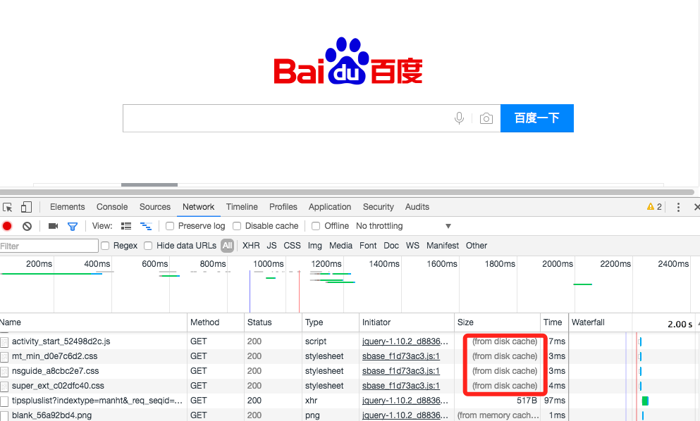

# http-cache
* author: pighead4u
* time: 2017/02/13
* version: 1.0.0
* 
---
## 优点：
* 减少了冗余的数据传输
* 缓解了网络瓶颈的问题
* 降低了对原始服务器的要求
* 降低了距离时延
---
## 问题
* 过期
---
## http再验证
### If-Modified-Since
### Date
### Age
### Cache-Control（缓存存储策略）
*  Public：会缓存文件数据
*  Private：会缓存文件数据
*  no-cache：“不建议使用本地缓存”，其仍然会缓存数据到本地
*  max-age：会缓存文件数据
*  no-store：不会在客户端缓存任何响应数据
### Expires（缓存过期策略）
* 用来确认存储在本地的缓存数据是否已过期，进而决定是否要发请求到服务端获取数据
* 指名了缓存数据有效的绝对时间，告诉客户端到了这个时间点（比照客户端时间点）后本地缓存就作废了，在这个时间点内客户端可以认为缓存数据有效，可直接从缓存中加载展示

---
## 参考文章：
* 《HTTP权威指南》
* 彻底弄懂 Http 缓存机制：http://mp.weixin.qq.com/s/qOMO0LIdA47j3RjhbCWUEQ
* 浅谈浏览器http的缓存机制：http://www.cnblogs.com/vajoy/p/5341664.html